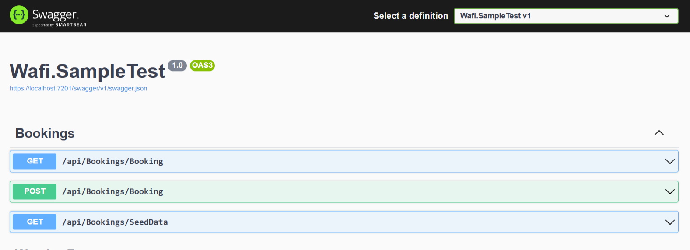

# **Full Stack (.NET Core)**

## **Car Booking App \- Interview Test**

### **Prerequisites**

### **Backend Candidates:**

* Download the sample project and write your code **(Wafi.SampleTest)**
* Must have knowledge of C\# and .NET Core basics.
* Understanding of OOP principles.
* Experience with building RESTful APIs.
* Knowledge of validation, error handling, and database operations.

---

## **Backend Team**

### **Tasks (100 Marks)**

1. **Create Booking API (40 Marks)**
    * Implement API to create a booking while ensuring that there are no duplicate bookings for the same car within the same date/time range.
    * Handle booking recurrence for daily and weekly repeat options.
    * Validate inputs and return appropriate error responses.
    * Breakdown:
        * API Functionality (20 Marks)
        * Validation & Business Rules (10 Marks)
        * Error Handling & Responses (10 Marks)
2. **Get Calendar Bookings API (35 Marks)**
    * Retrieve booking records and format them for calendar display.
    * Handle "DoesNotRepeat", "Daily", and "Weekly" repeat options.
    * Group data by day for better calendar visualization.
    * Breakdown:
        * API Functionality (15 Marks)
        * Filtering Implementation (10 Marks)
        * Code Readability & Performance (10 Marks)
3. **Bonus \- Unit Testing (10 Marks)**
    * Implement unit tests for APIs to validate functionality and business rules.
4. **Video Demonstration (15 Marks)**

---

#### 

#### 

### **Acceptance Criteria**

* The booking system should prevent duplicate bookings for the same car at overlapping time slots.
* The API should support retrieval of bookings in a structured format for calendar view.
* The API should support filtering by `carId`, `startBookingDate`, and `endBookingDate`.
* Proper error handling and validation should be implemented.

---

### **Submission Requirements**

* Candidates must record a **3-5 minute video** demonstrating:
    * Understanding of the requirements.
    * Approach to solving the problem.
    * Code overview and explanation.
    * Output demonstration.
* It is acceptable if candidates cannot complete all requirements, but they should submit their progress.
* In the **viva session**, candidates will be asked questions about their code.
* Any instance of plagiarism or external help will result in **immediate disqualification**.

---

### **Additional Notes**

* Candidates will be provided with API documentation and UI design separately.
* Filtering functionality is required for both backend and frontend implementations.
* Seed data will be provided for testing backend functionality.

---

---